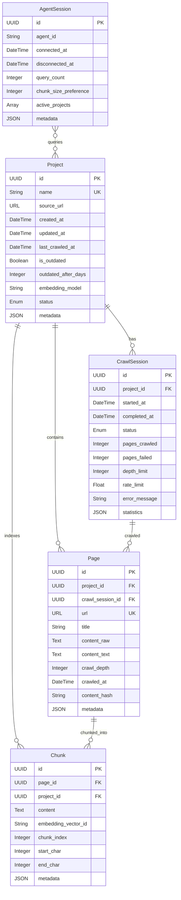

# Data Model: DocBro

**Date**: 2025-09-25
**Feature**: Documentation Web Crawler with Local RAG

## Entity Definitions

### Project
Represents a crawled documentation source with its configuration and metadata.

**Fields**:
- `id`: UUID - Unique identifier
- `name`: String (required, unique) - User-defined project name
- `source_url`: URL (required) - Original documentation URL
- `created_at`: DateTime - Project creation timestamp
- `updated_at`: DateTime - Last modification timestamp
- `last_crawled_at`: DateTime (nullable) - Last successful crawl timestamp
- `is_outdated`: Boolean - Computed from last_crawled_at vs configured interval
- `outdated_after_days`: Integer (default: 60) - Days until marked outdated
- `embedding_model`: String (default: "mxbai-embed-large") - Ollama model used
- `status`: Enum - Project status (creating, ready, crawling, error)
- `metadata`: JSON - Additional project configuration

**Validation Rules**:
- Name must be 1-50 characters, alphanumeric with hyphens/underscores
- Source URL must be valid HTTP/HTTPS
- Outdated_after_days must be between 1 and 365

**State Transitions**:
```
creating -> ready (after initial crawl)
ready -> crawling (during crawl operation)
crawling -> ready (on success)
crawling -> error (on failure)
error -> crawling (on retry)
```

### CrawlSession
Tracks individual crawl operations for a project.

**Fields**:
- `id`: UUID - Unique identifier
- `project_id`: UUID (FK) - Associated project
- `started_at`: DateTime - Crawl start timestamp
- `completed_at`: DateTime (nullable) - Crawl completion timestamp
- `status`: Enum - Session status (running, completed, failed, cancelled)
- `pages_crawled`: Integer - Number of pages successfully crawled
- `pages_failed`: Integer - Number of pages that failed
- `depth_limit`: Integer - Maximum crawl depth configured
- `rate_limit`: Float - Requests per second limit
- `error_message`: String (nullable) - Error details if failed
- `statistics`: JSON - Crawl statistics and metrics

**Validation Rules**:
- Depth_limit must be between 1 and 10
- Rate_limit must be between 0.1 and 10.0
- Pages counts must be non-negative

### Page
Individual documentation page with its content and embeddings.

**Fields**:
- `id`: UUID - Unique identifier
- `project_id`: UUID (FK) - Associated project
- `crawl_session_id`: UUID (FK) - Source crawl session
- `url`: URL (required) - Full page URL
- `title`: String - Page title from HTML
- `content_raw`: Text - Original HTML content
- `content_text`: Text - Extracted text content
- `crawl_depth`: Integer - Depth from root URL
- `crawled_at`: DateTime - When page was crawled
- `content_hash`: String - SHA-256 of content for deduplication
- `metadata`: JSON - Additional page metadata (headers, links, etc.)

**Validation Rules**:
- URL must be valid HTTP/HTTPS
- Crawl_depth must be non-negative
- Content_hash must be valid SHA-256

### Chunk
Text chunks with embeddings for vector search.

**Fields**:
- `id`: UUID - Unique identifier
- `page_id`: UUID (FK) - Source page
- `project_id`: UUID (FK) - Associated project (denormalized for performance)
- `content`: Text - Chunk text content
- `embedding_vector_id`: String - Reference to Qdrant point ID
- `chunk_index`: Integer - Position in source page
- `start_char`: Integer - Starting character position in page
- `end_char`: Integer - Ending character position in page
- `metadata`: JSON - Chunk metadata (headers, context, etc.)

**Validation Rules**:
- Content length between 100 and 2000 characters
- Chunk_index must be non-negative
- Start_char < end_char

### QueryResult
Represents a search result from RAG operations.

**Fields**:
- `chunk_id`: UUID - Source chunk identifier
- `project_id`: UUID - Source project
- `page_url`: URL - Source page URL
- `page_title`: String - Source page title
- `content`: Text - Chunk content
- `relevance_score`: Float - Similarity/relevance score (0-1)
- `rerank_score`: Float (nullable) - Reranking score if applied
- `metadata`: JSON - Additional result metadata

**Validation Rules**:
- Relevance_score must be between 0 and 1
- Rerank_score must be between 0 and 1 if present

### AgentSession
Tracks MCP agent connections and interactions.

**Fields**:
- `id`: UUID - Unique identifier
- `agent_id`: String - Agent identifier
- `connected_at`: DateTime - Connection timestamp
- `disconnected_at`: DateTime (nullable) - Disconnection timestamp
- `query_count`: Integer - Number of queries in session
- `chunk_size_preference`: Integer (default: 1000) - Preferred chunk size
- `active_projects`: Array<UUID> - Projects accessed in session
- `metadata`: JSON - Agent configuration and preferences

**Validation Rules**:
- Agent_id must be non-empty
- Query_count must be non-negative
- Chunk_size_preference between 100 and 5000

## Relationships



## Storage Strategy

### SQLite (Metadata Storage)
- Projects table
- CrawlSessions table
- Pages table (metadata only, content in filesystem)
- AgentSessions table

### Qdrant (Vector Storage)
- One collection per project (named: `docbro_project_{project_id}`)
- Points store chunk embeddings with metadata payload
- Indexed for semantic similarity search

### Filesystem (Optional Content Cache)
- Raw HTML stored in: `~/.docbro/projects/{project_id}/pages/`
- Compressed with gzip to save space
- Named by content_hash for deduplication

### Redis (Operational Cache)
- Crawl queue for URL deduplication
- Recent query cache with TTL
- Session state for active crawls

## Data Integrity Constraints

### Cascading Deletes
- Deleting Project cascades to all CrawlSessions, Pages, Chunks
- Deleting CrawlSession does NOT delete Pages (retain for history)
- Deleting Page cascades to all its Chunks

### Unique Constraints
- Project.name must be unique
- Page.url must be unique within a project
- Chunk.(page_id, chunk_index) must be unique

### Consistency Rules
- Project.last_crawled_at must match most recent successful CrawlSession
- Project.is_outdated computed from last_crawled_at and outdated_after_days
- Page.content_hash must match SHA-256 of content_raw

## Migration Strategy

### Initial Schema (v1.0.0)
- All tables created as defined above
- Indexes on foreign keys and frequently queried fields
- Default values for backward compatibility

### Future Considerations
- Incremental crawl support (diff tracking)
- Multi-language content support
- Custom chunking strategies per project
- Embedding version tracking for model upgrades